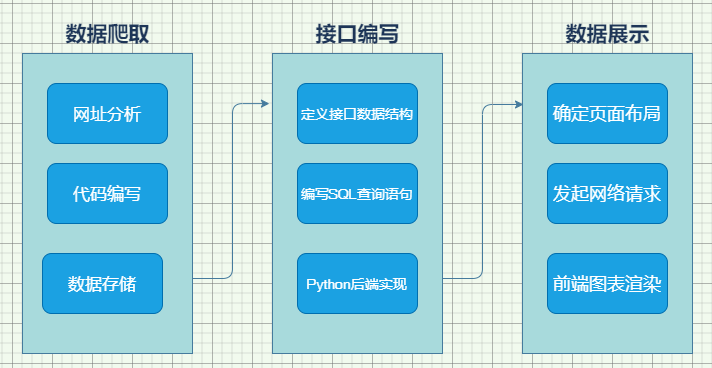

## 猫眼电影数据爬取与分析——说明书

## 一、项目介绍
    将猫眼电影的所有电源详细数据进行爬取，并存储到MySQL数据库中，
    其中包括名称、时间、评分、票房、类别、年代和地区等等关键属性，
    最后编写后端接口，为前端数据可视化展示提供数据支持。
    数据可视化通过微信小程序进行，主要以各种不同类型的图表展现。

## 二、项目分工
    设计分析：熊维建
    数据爬取：滕明城
    数据存储：滕明城
    接口编写：滕明成
    数据可视化：熊维建

目标：https://maoyan.com/films?showType=3&offset=0

将所有数据爬取，并清洗出属性，包括电影名、类别、区域、年份，口碑分、票房、电影时长，
然后将所有数据存储到MySQL数据库中。

流程图：



## 三、接口文档

### （1）折线图

https://v-charts.js.org/#/line

1. 按年：数量、平均分、票房
1. 按月：数量、平均分、票房

年：最高前5年+其它

```js
data = [
  {"年份": 2020, "数量": 526, "平均分": 6.5, "票房": 666},
  {"年份": 2020, "数量": 526, "平均分": 6.5, "票房": 666},
  {"年份": 2020, "数量": 526, "平均分": 6.5, "票房": 666},
  {"年份": "其它", "数量": 2526, "平均分": 6.5, "票房": 666}
]
data = [
  {"月份": 1, "数量": 526, "平均分": 6.5, "票房": 666},
  {"月份": 2, "数量": 526, "平均分": 6.5, "票房": 666},
  {"月份": 8, "数量": 526, "平均分": 6.5, "票房": 666},
  {"月份": 11, "数量": 526, "平均分": 6.5, "票房": 666}
]
```

### （2）饼图

https://v-charts.js.org/#/pie

1. 票房前5的国家 + 其它
2. 票房前5的年份 + 其它
3. 票房前5的类型 + 其它

```js
data = [
  {"国家": "xxx", "票房": 56534},
  {"国家": "xxx", "票房": 56534},
  {"国家": "其它", "票房": 56534}
]
data = [
  {"年份": "xxx", "票房": 56534},
  {"年份": "xxx", "票房": 56534},
  {"年份": "其它", "票房": 56534}
]
data = [
  {"类型": "xxx", "票房": 56534},
  {"类型": "xxx", "票房": 56534},
  {"类型": "其它", "票房": 56534}
]
```
## （3）条形图

https://v-charts.js.org/#/bar


前5+其它

按类别分：国内+国外 的 票房

按年份分：国内+国外 的 口碑均分

```js
data = [
    {"类别": "xx", "国内": 12467, "国外": 5438},
    {"类别": "xx", "国内": 12467, "国外": 5438},
    {"类别": "xx", "国内": 12467, "国外": 5438}
]
data = [
    {"年份": "xx", "国内": 12467, "国外": 5438},
    {"年份": "xx", "国内": 12467, "国外": 5438},
    {"年份": "xx", "国内": 12467, "国外": 5438}
]
```

### （4）雷达图

https://v-charts.js.org/#/radar

前5条 + 其它

1. 类型+平均分+总票房
2. 地区+平均分+总票房

```js
data = [
  {"类型": "爱情", "平均分": 8.6, "总票房": 6666},
  {"类型": "爱情", "平均分": 8.6, "总票房": 6666},
  {"类型": "其它", "平均分": 8.6, "总票房": 6666}
]

data = [
  {"地区": "爱情", "平均分": 8.6, "总票房": 6666},
  {"地区": "爱情", "平均分": 8.6, "总票房": 6666},
  {"地区": "其它", "平均分": 8.6, "总票房": 6666}
]

```


### （4）接口路由&数据结构定义

/api/all

```js
{
  // 一、折线图
  "one": {
    "year": [
      {"年份": 2020, "数量": 666, "平均分":8.6, "票房": 6666},
      {"年份": 2020, "数量": 666, "平均分":8.6, "票房": 6666},
      {"年份": "其它", "数量": 666, "平均分":8.6, "票房": 6666}
    ],
    "month": [   
      {"月份": 1, "数量": 666, "平均分":8.6, "票房": 6666},
      {"月份": 2, "数量": 666, "平均分":8.6, "票房": 6666},
      {"月份": 12, "数量": 666, "平均分":8.6, "票房": 6666}
    ]
  },


  // 二、饼图
  "two": {
    "country": [
         {"国家": "xxx", "票房": 56534},
         {"国家": "xxx", "票房": 56534},
         {"国家": "其它", "票房": 56534}
       ],
    "year": [
          {"年份": "xxx", "票房": 56534},
          {"年份": "xxx", "票房": 56534},
          {"年份": "其它", "票房": 56534}
        ],
    "type": [
          {"类型": "xxx", "票房": 56534},
          {"类型": "xxx", "票房": 56534},
          {"类型": "其它", "票房": 56534}
        ]
  },


  // 三、条形图
  "three": {
    // 按电影类型
    "type": [
        {"类别": "xx", "国内": 12467, "国外": 5438},
        {"类别": "xx", "国内": 12467, "国外": 5438},
        {"类别": "xx", "国内": 12467, "国外": 5438}
    ],
    // 按电影年份
    "year": [
        {"年份": "xx", "国内": 12467, "国外": 5438},
        {"年份": "xx", "国内": 12467, "国外": 5438},
        {"年份": "xx", "国内": 12467, "国外": 5438}
    ]
  },


  // 四、雷达图
  "four": {
    // 1. 类型+平均分
    "type": [
      {"类型": "爱情", "平均分": 8.2, "总票房": 70},
      {"类型": "爱情", "平均分": 8.2, "总票房": 60},
      {"类型": "其它", "平均分": 8.2, "总票房": 42}
    ],
    "area": [
      {"地区": "中国大陆", "平均分": 8.2, "总票房": 70},
      {"地区": "中国大陆", "平均分": 8.2, "总票房": 60},
      {"地区": "其它", "平均分": 8.2, "总票房": 42}
    ]
  }
}
```

## 三、数据爬取

1. 通过Requests发起网络请求，获取纯文本html内容。

    爬取过快防封策略：
    - 不在乎速度，请求间隔设置延迟，睡一觉醒来，需要的数据就都到手了。
    - 在乎速度，通过代理连接池，每个请求都是不同的IP，达到防封效果。

2. 然后将获取的纯文本html内容通过BeautifulSoup库进行数据清洗，提取所需要的数据。
    
    - 分析元素选择器：获取到所需数据的选择器，快速定位到标签。
    - 分析数据特征：数据同标签时，分析分隔符号。
    - 分析反爬策略：自定义字体，分析字库编号，将编号一一对应，实现反反爬。
    
3. 将数据库通过pymsql库存储到预先配置好的MySQL服务器中。
    
    - 存储过程 或 直接SQL语句查询
    
## 四、数据存储

使用Pymysql依赖包连接预先配置好的MySQL服务端，将所有数据按表形式存储在数据库当中。

## 五、接口编写

使用Python当中小巧的Flask框架编写后端接口，主要通过SQL语句对数据库进行查询和处理后，提供数据接口，
处理前端http请求，将数据返回给前端进行展示。

## 六、前端数据展示

1. 通过前端[Vue.js](https://vuejs.org/) 框架，进行快捷的Web前端界面逻辑编写。
2. 通过软件包 [Axios](https://www.npmjs.com/package/axios) ，发起异步网络请求，向后端获取数据。
3. 通过开源的 [v-charts](https://github.com/ElemeFE/v-charts) 图表组件，进行数据展示。

## 7、通过数据进行分析


1、通过按年度票房和数量展示的折线图，近5年国内电影行业一直保持着每年25%的增长，
同样2020年相对于2016-2019年的涨势，出现骤跌。
这很大一部分原因是因为2020年的新冠疫情爆发而导致，当时年度贺岁片纷纷撤档，冲击了国内外所有电影行业。

2、通过按月份电影数量展示的折线图，可以看到从5月到9月一直呈现上升态势，
在9月的时候电影数量达到顶峰，这可能是因为9月是开学季也是大家最有钱的时候，
刚开学大家都愿意花钱去吃喝玩乐，所以电影上映时间都倾向于设定在9月。而到了10月份，电影数量骤减，
因为开学热刚过，大家都进入了学习的节奏和状态，观影需求也相对较低。

3、通过各地区票房占比饼图来分析，国内票房主要有两大块，分别是大陆电影和美国电影，占到了51%和38%，
这与我已有的常识有一点偏差。

4、通过不同电影类型票房占比饼图分析，国内最多的观影票房是动作和冒险，这很可能是跟近几年爆火的几部电影有关，
如战狼2、流浪地球、红海行动、唐人街探案等等，这几部爆火的电影占到了国内很大一部分票房。

5、通过国内外按年度票房对比条形图分析，国内票房从国外电影多于国内电影，出现反转态势，国内电影行业大好。

6、通过国内外按电影类型票房对比条形图分析，国内电影与国外差距最大的类型是科幻类和冒险类，差距接近6倍，其次是动作片，差距大概2倍。
而国内电影市场类型主要集中在喜剧和剧情，这两类在国内票房都远超国外电影。这主要可能是与电影制片成本有关，科幻冒险电影，都需要巨额成本进行特效制作。
而喜剧和剧情只需要演员和好的剧情就能满足，所以我认为国内电影也许更应该把资金投入到电影制作里来，而不是把钱全部砸到天价演员身上。

7、通过电影类型雷达图进行分析，xxx类表现较为均衡，没有出现偏科情况。而xxxx类在其它项表现正常，而票房中表现较差。

8、通过电影地区雷达图进行分析，国内电影票房表现较为均衡，而其它国外电影在国内票房就比较低了，当然这种情况在国内来分析很正常。

最后，不管是按年份、月份、地区和类型分，电影的评分都大致相同，基本保持在8.2分左右。
总结：
国内电影不管从质量和数量上，整体呈现上升态势，如果可以
